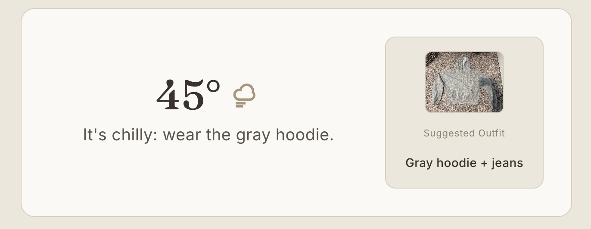
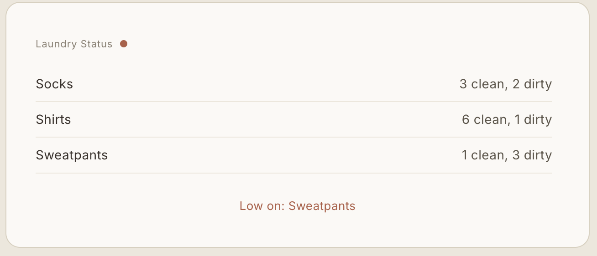
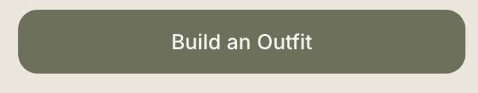
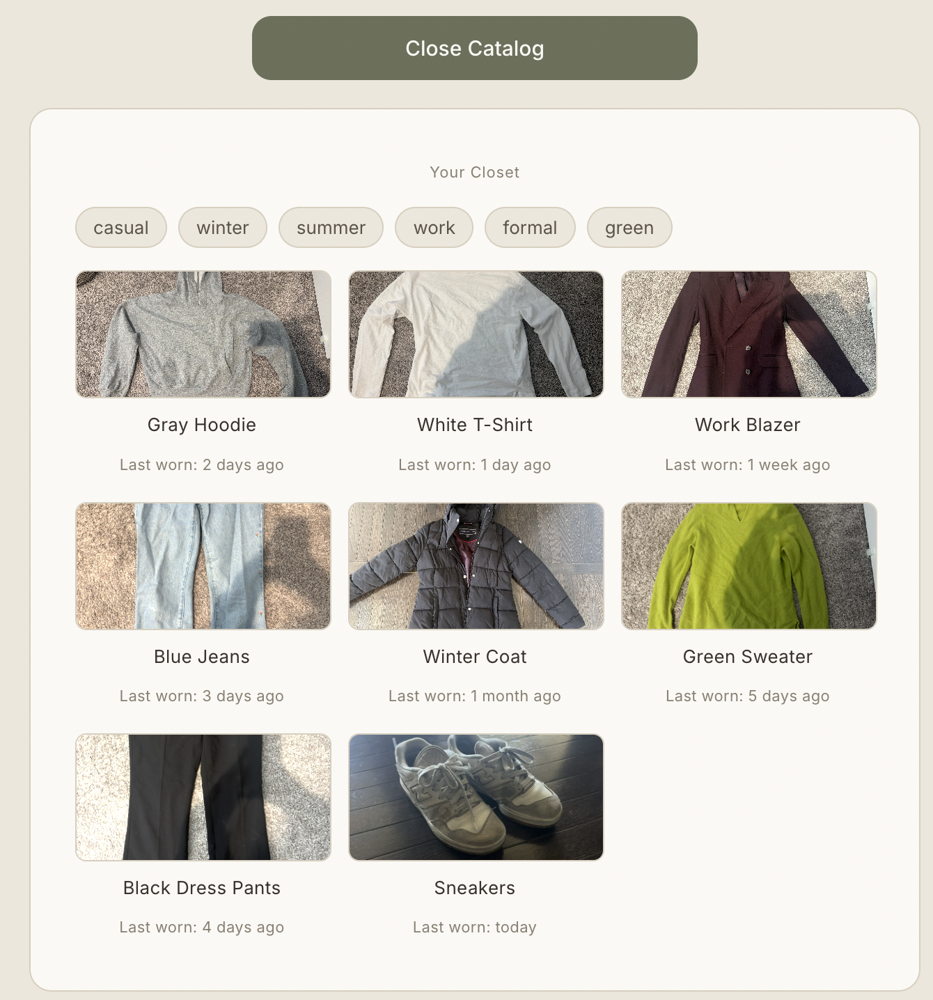
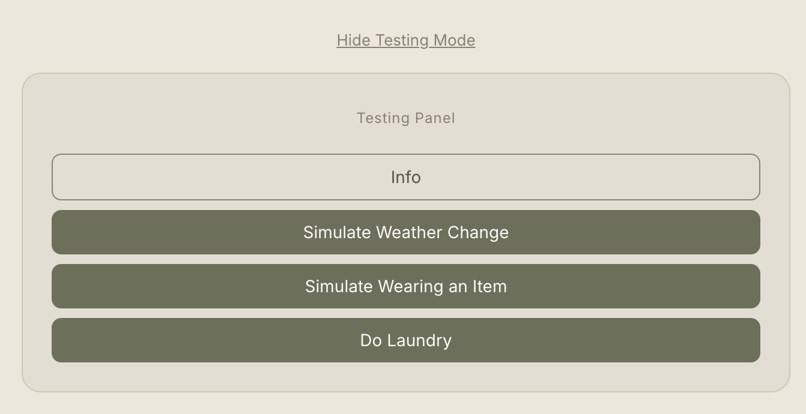

# Smart Closet — Project 1

By Salwa Syed

## About the Project

Smart Closet is a digital mock-up UI for a smart walk-in closet, designed and built as a UI design course project. The interface imagines a panel mounted on the outside of a closet door that helps a user decide what to wear, track their laundry, and browse their wardrobe all while not having to step inside or dig through hanger, drawers, or basekts first.

Core features:
- **Weather-based outfit suggestions** — displays the current temperature, a weather icon, and a corresponding outfit recommendation with a photo
- **Laundry status tracking** — shows clean/dirty counts per clothing category, with a low-stock alert when essentials are running out
- **Build an Outfit catalog** — a browsable, tag-filterable view of the closet's contents, similar to filtering on a shopping site

Full design process — affordances, user interviews, sketches, and
evaluation — is documented separately in
[design/design.md](design/design.md).

## Interface Walkthrough

### Weather & Outfit Suggestion
The top panel shows the current temperature, a weather icon (sun, cloud, windy-cloud, or snowflake depending on conditions), and a suggested outfit with a photo. Clicking **Simulate Weather Change** in the testing panel cycles through different conditions to preview each suggestion.

### Laundry Status
Below the weather panel, a scrollable list shows clean vs. dirty counts for each clothing category. If any category drops to 0 or 1 clean items, a red alert text appears listing what's running low.

### Build an Outfit (Catalog)
Clicking the **Build an Outfit** button opens a tag-filterable catalog of the closet's contents.

Users can add filter tags (ex. "casual," "winter") to narrow results, and remove them individually via the X on each tag chip. Each item shows a photo and when it was last worn.

### Testing Panel
For demo purposes, a Testing Panel (not part of the real device UI) lets a reviewer trigger state changes: simulate a weather change, simulate wearing an item, do laundry, or view info about the testing controls.

## Implementation

Built as a single-page Svelte app (`App.svelte`).

**Stack:**
- Svelte (reactive UI, `$:` reactive statements for derived state like `filteredItems`, `lowStockItems`, and `allTags`)
- Plain CSS (no framework) — custom design tokens (colors, spacing, type) kept consistent across all panels
- Inline SVG for weather icons (sun, cloud, windy-cloud, snowflake), built with a rotate-and-repeat technique for the snowflake so one "arm" shape is reused 6 times at 60° rotations instead of hand-placing every line

**State & data:**
- `suggestions` — an array of weather/outfit pairings (temp, text, outfit name, photo, and a `condition` key used to pick the matching weather icon)
- `laundry` — array of clothing categories with clean/dirty counts;
  `lowStockItems` is derived reactively whenever counts change
- `catalogItems` — the closet's browsable inventory, each with tags and a
  `lastWorn` value
- `activeTags` — user-selected filter tags; `filteredItems` reactively narrows `catalogItems` to only items matching every active tag

**Structure:**
- Device UI region: weather/outfit panel, laundry status panel, and the "Build an Outfit" catalog panel (toggled open/closed)
- Testing UI region: separate from the Device UI, lets a reviewer trigger state changes (`getNewSuggestion`, `simulateWear`, `doLaundry`) to see how the Device UI responds without needing real sensors or hardware

## Level 2+ Feature: Option 1 (Complex Selections)

For the Levels 2-4 requirement, I chose **Option 1: Enable the user to input a complex set of selections**, implemented as the **Build an Outfit catalog**.

The Level 1 interface only shows a single auto-generated outfit suggestion based on the current weather — it doesn't let the user browse or select from their full wardrobe. The catalog addresses this by letting users input a more complex, multi-part selection: choosing *any combination* of tags (ex. "casual" + "winter") to narrow down exactly which items they want to see, rather than being limited to one preset suggestion at a time.

- **Clear selection feedback:** Active filter tags are shown as removable chips at the top of the panel, so the user can always see exactly which filters are currently applied.
- **Quick feedback on selections:** The catalog grid updates immediately as tags are added or removed, showing only items matching every active tag; a "No items match these tags" message appears if the combination returns nothing.
- **Additional context per item:** Each result shows a photo and a "last worn" timestamp, giving the user more information to base their final choice on beyond just the filter match.

## AI Usage

AI (Claude) was used throughout this project in the following ways:

- Summarizing interview notes to make them cleaner and easier to follow
- Helping narrow down user needs based on interview findings
- Understanding the Svelte template used for this project and identifying where to make edits
- Generating SVG syntax for the weather condition icons (sun, cloud, windy-cloud, snowflake)
- Summarizing and refining documentation text for clarity and flow
- A LOT of Debugging issues in the code

## Future Work

- **Combined outfit preview** — Currently, "Build an Outfit" only supports browsing and filtering individual catalog items. A user interview (Shahar) specifically wanted to select multiple items and preview them together as a full outfit, rather than only seeing single pre-set suggestion photos. This would be the next feature to build.
- **Phone app companion** — Two of three interviewees wanted closet information (laundry status, outfit suggestions) accessible from a phone app rather than only the physical panel. A secondary mock mobile UI region would be a great way to do this.
- **Physical item-location indicator** — One interviewee liked the idea of the closet lighting up or otherwise indicating where a suggested item is physically located (ex. a light near matching clothes). This isn't feasible to simulate meaningfully in a browser UI alone and would require actual hardware integration.
- **Live weather data** — Weather conditions are currently mocked via a fixed set of `suggestions`; a real version would pull live temperature data for the user's location.
- **AI-generated outfit preview on the user** — Rather than showing outfit photos as flat-lay images, a future version could use an AI image generation model to render the suggested or built outfit as if worn by the user (ex. from an uploaded photo), giving a much more realistic sense of fit and appearance before getting dressed.

## Demo Video

[Watch my demo video](https://drive.google.com/file/d/1_ffK-8PYkv9-8b3MuW36NrQ20DVbu9im/view?usp=sharing) — a walkthrough covering:
- Project name and author
- The project components (weather/outfit suggestion, laundry tracking, outfit catalog, testing panel)
- A live demo of each feature in action, using the Testing Panel to trigger state changes

## Links

- **Source code:** [GitHub repository](https://github.com/salwasyedd/ui-design-portfolio/tree/main/project1-smart-closet)
- **Live app:** [https://smart-closet-salwasyed.vercel.app/](https://smart-closet-salwasyed.vercel.app/)
- **Design write-up:** [design/design.md](design/design.md)

## Running locally
npm install
npm run dev